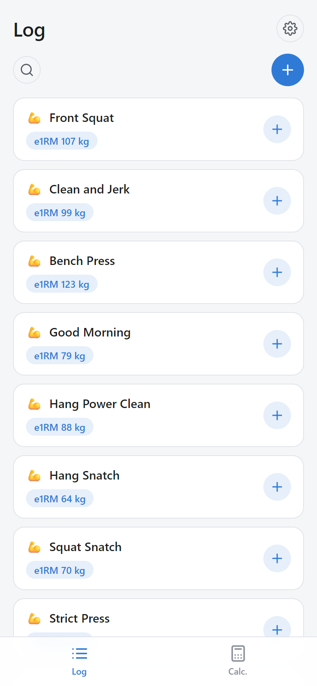
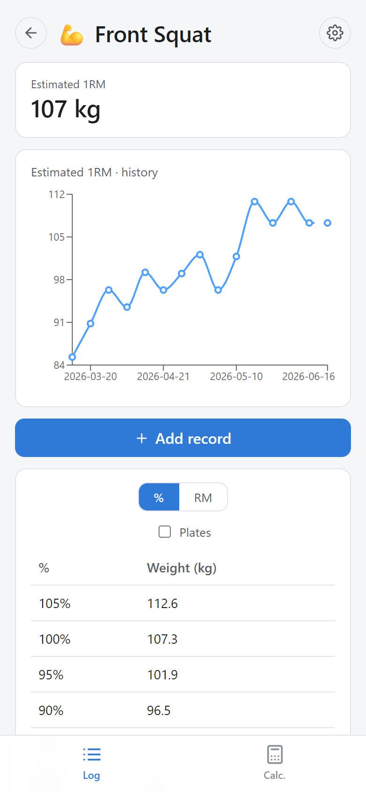
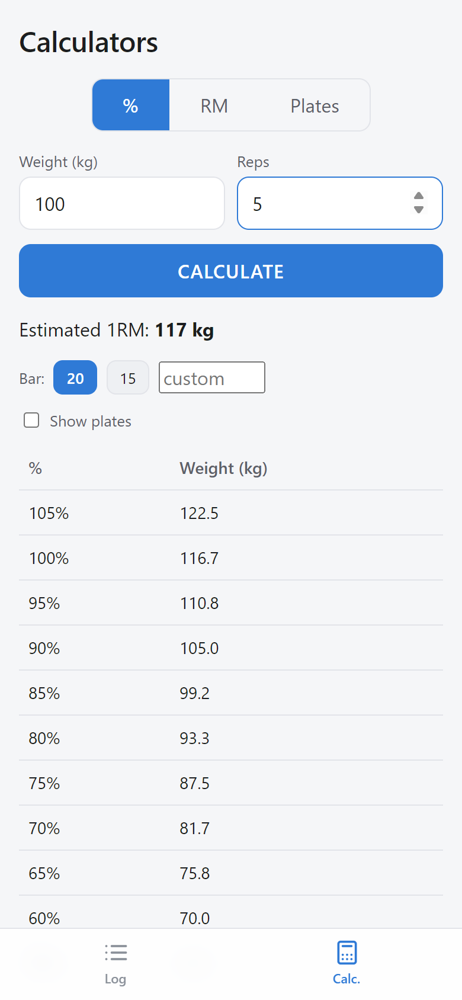
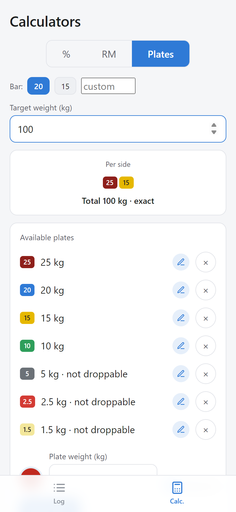

# LiftLog

[](https://github.com/javierBF97/liftlog-pwa/actions/workflows/ci.yml)

A local-first web app to log your lifts and plan your loads.

<p align="center">
  
  
  
  
</p>

LiftLog runs in the browser and installs to your phone's home screen as a
PWA. It works offline. It has no accounts and no server: your data stays on
your device, and you can export all of it to a JSON file.

## Try it

The app is live at
[javierbf97.github.io/liftlog-pwa](https://javierbf97.github.io/liftlog-pwa/).

1. Open the URL on your phone.
2. Install it. Android (Chrome): ⋮ menu → *Add to Home screen*. iPhone
   (Safari): share button → *Add to Home Screen*.
3. Search for a lift and log your first set. The app ships with ~113
   CrossFit exercises already classified by type, so there is nothing to
   import. To see it with data instead, import
   [`mock-data.json`](mock-data.json) from **Log → ⚙ Settings → Import
   backup** (~3 months of sample history).

You can also self-host it on any static server (see
[Development](#development)).

## Features

- **Per-type logging**: strength (weight × reps), gymnastics (reps,
  modality, time), cardio (distance/calories + time), and carries
  (weight + distance). Each type gets its own headline metric, charts,
  and history columns.
- **Estimated 1RM**, with a progression chart, a percentage table
  (105% → 30%), and an RM table (1RM–16RM).
- **Plate calculator**: the plates to load per side for a target weight.
- **Configurable plate set**: weight, color, and whether you can drop it.
- **Bilingual UI** (English/Spanish). It follows the system language, and
  you can switch anytime.
- **Backup**: export and import all your data as one JSON file.
- **Starter library**: [`crossfit-base.json`](crossfit-base.json) ships with
  the app and seeds a new device on first run. The log lists only exercises
  you have logged; search reveals the whole library.

## How it works

### 1RM estimation

LiftLog estimates the one-rep max with the Epley formula:

```
e1RM = w × (1 + r / 30)
```

The inverse form gives the weight you can lift for *n* reps:
`w = e1RM / (1 + n / 30)`. One logged set is enough to build the full
percentage table and the RM table.

### Plate calculator

The calculator works per side and in 0.5 kg units, so all arithmetic stays
in integers. A dynamic program finds the best plate combination for every
reachable weight, up to one plate above the target. It then scores each
weight: distance to the target, plus a penalty per plate. The penalty stops
the calculator from stacking many small plates to shave a fraction. Ties
prefer fewer non-droppable plates, then fewer plates in total. If the exact
weight is not loadable with your plate set, the result is the closest
loadable weight, marked as such.

### Data and persistence

All state is one versioned JSON document in `localStorage`. On first run,
when the key is absent, the app seeds it with the bundled exercise library;
an empty stored state means you deleted everything, so it is never reseeded.
The volume is small: a year of training is a few hundred entries, well under
100 KB.
Every import passes through `sanitizeState`, which validates each entry and
drops malformed ones instead of failing. At startup the app requests
persistent storage, so the browser does not evict the data under disk
pressure. The JSON export is a complete backup — and the migration path if
the data model ever outgrows `localStorage`.

### Architecture

```
src/
  lib/         domain logic (1RM, plates, persistence, metrics) — no React
  components/  reusable components (tables, charts, selectors)
  pages/       screens (Log, Detail, Calculators)
scripts/       sample-data generators
```

Domain logic is plain JavaScript with no React imports, so it is tested in
isolation. Every module keeps its test file next to it.

## Development

```bash
npm install
npm run dev        # dev server with hot reload
npm test           # test suite (125 tests, Vitest + Testing Library)
npm run lint       # ESLint
npm run build      # production build in dist/
```

**Stack**: React 19 · Vite 8 · Recharts 3 · vite-plugin-pwa

CI runs lint, tests, and build on every push. A second workflow deploys the
build to GitHub Pages.

## License

[MIT](LICENSE)
